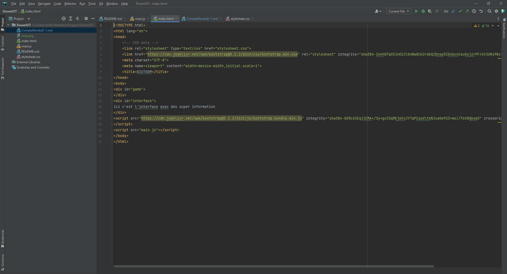
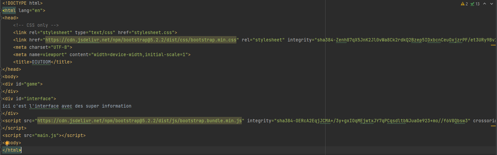
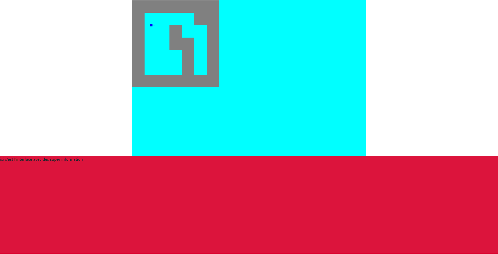
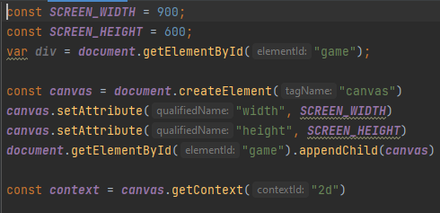
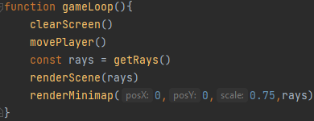
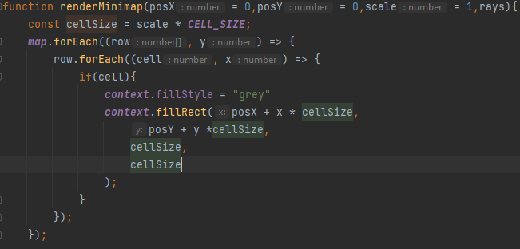
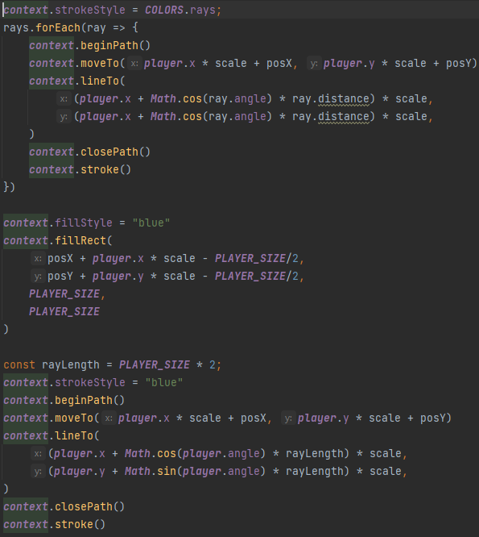
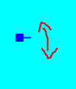

# Compte Rendu Jour-1
***

Aujourd'hui j'ai commencé par créer mon espace de travail avec github et à relier toutes mes machines.
  https://github.com/MrTGK0386/DoomIUT
  
J'ai eu quelques difficulté à mettre en place mon IDE sur mon nouveal ordinateur car je n'ai pas réussi à synchroniser ma licence (je suis donc obligé d'utilisé une version d'esai).

 
J'ai ensuite créer mon fichier HTML et positioner mes divs, la première sert à afficher mon jeu et la deuxième servira à faire apparaître des information sur le lieux dans lequel on se trouve dans l'IUT.

 
Après ça, j'ai fait mon CSS pour mettre tout ça en page et j'ai relié les librairies bootstrap à mon fichier même si je ne m'en sert pas encore.

 
Enfin j'ai commencé le développement de mon moteur de jeu, j'ai commencé par créer un espace pour afficher mon jeux. 

 
J'ai ensuite préparer les variables et les fonction que je remplirais au fur et à mesure.
 

 
J'ai commencé par faire la minimap, qui me servira pour générer les cartes et les collisions.
 

 
J'ai ensuite positioner mon joueur sur la carte et lui est donné la capacité d'avancer et de reculer.
 

 
L'étape suivante est la gestion de l'angle du joueur sur la carte pour pouvoir évoluer en 2D.
 

 

***

*fait par Etienne Garcia MMI1 groupe : A2*